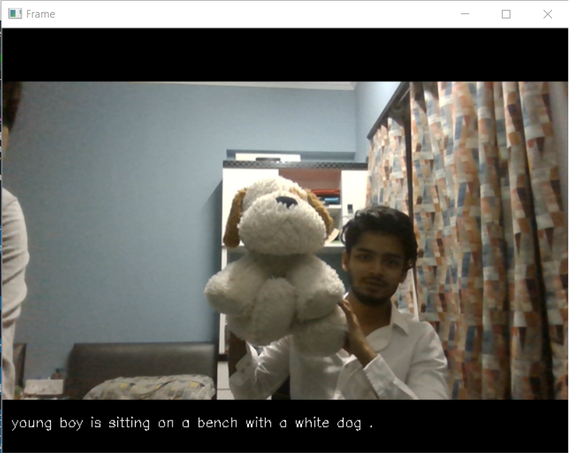
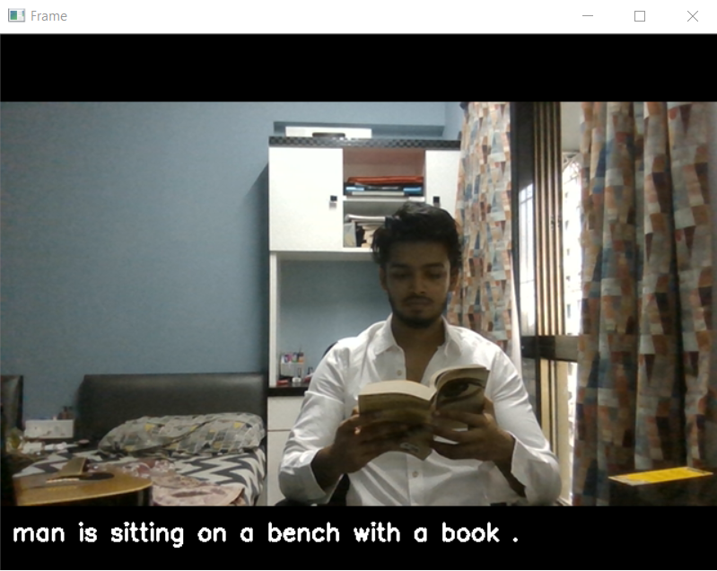
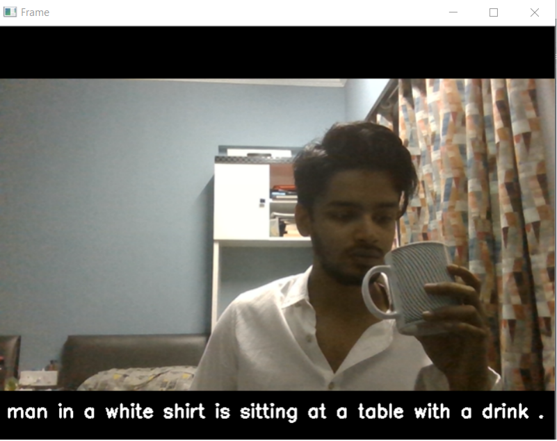
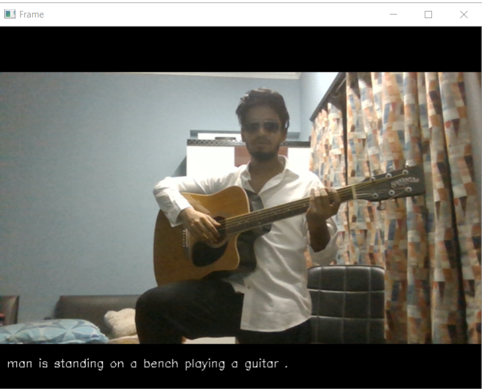
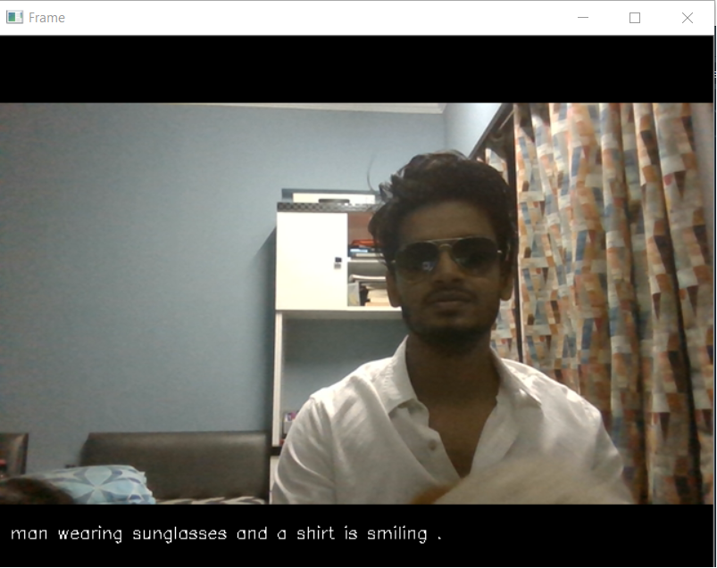
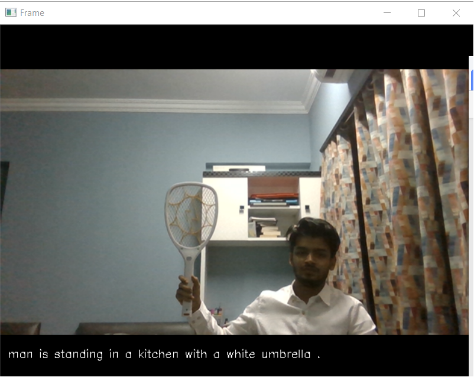
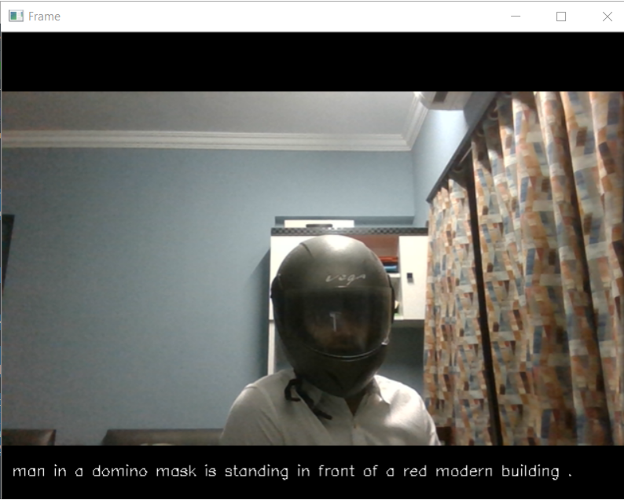

#     Real-Time Video Captioning

Humans are able to able to identify objects and describe what we see with great accuracy even with a small glimpse. Although this is a trivial thing for us, it is challenging for machines.

Some of the top performing Convolutional Neural Networks (CNNs) on the ImageNet challenge such as VGG16, AlexNet and InceptionV3 are able to classify images very accurately between a 1000 different classes. However they alone are not capable of generating human-readable captions or descriptions of a given image.

This is a fundamental problem in Machine Learning where Computer Vision and Natural Language Processing meet. Based on this I have implemented Real-Time Video Captioning.

The basic idea is that the features of an image is extracted using a Convolutional Neural Network and the captions are fed into a Recurrent Neural Network which generates a fixed-length vector. Both the features and vectors are concatenated and fed
Into Fully Connected Layers where the final layer outputs the Softmax activation for each word in our vocabulary.

Taking this idea a step forward I’ve adapted this model to describe the frames captured by the webcam in real-time.

This can have many real life use cases like Assault Detection, Detect if a person is drowning, Generate captions of movie scenes and many more. 

I have posted some of the predictions below.
As you’ll can see the model is able to describe some frames really well. 

# Fails: (Some really big fails.)

What is Machine Learning without some misfire.

As you’ll can see not all captions make sense. There is still room for some fine-tuning and can be further trained on a larger dataset (Flickr30k or MS-Coco).

Thank you for reading. 

References:
1]Deep Visual-Semantic Alignments for Generating Image Desccriptions, 2015

2]Show and Tell: A Neural Image Caption Generator, 2015

3]Long-term Recurrent Convolutional Networks for Visual Recognition and Description, 2015

4]Deep Learning Photo Caption Generator, Jason Brownlee

